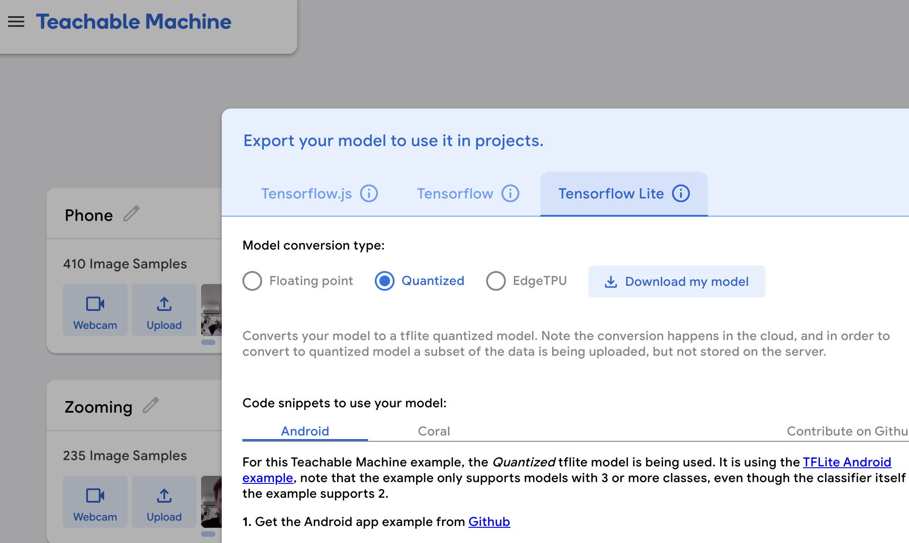

# Observant Systems

**Thomas Wallace & Stanley Walker & Chanan Suksangium**

For lab this week, we focus on creating interactive systems that can detect and respond to events or stimuli in the environment of the Pi, like the Boat Detector we mentioned in lecture. 
Your **observant device** could, for example, count items, find objects, recognize an event or continuously monitor a room.

This lab will help you think through the design of observant systems, particularly corner cases that the algorithms need to be aware of.

## Prep

1.  Install VNC on your laptop if you have not yet done so. This lab will actually require you to run script on your Pi through VNC so that you can see the video stream. Please refer to the [prep for Lab 2](https://github.com/FAR-Lab/Interactive-Lab-Hub/blob/-/Lab%202/prep.md#using-vnc-to-see-your-pi-desktop).
2.  Install the dependencies as described in the [prep document](prep.md). 
3.  Read about [OpenCV](https://opencv.org/about/),[Pytorch](https://pytorch.org/), [MediaPipe](https://mediapipe.dev/), and [TeachableMachines](https://teachablemachine.withgoogle.com/).
4.  Read Belloti, et al.'s [Making Sense of Sensing Systems: Five Questions for Designers and Researchers](https://www.cc.gatech.edu/~keith/pubs/chi2002-sensing.pdf).

### For the lab, you will need:
1. Pull the new Github Repo
1. Raspberry Pi
1. Webcam 

### Deliverables for this lab are:
1. Show pictures, videos of the "sense-making" algorithms you tried.
1. Show a video of how you embed one of these algorithms into your observant system.
1. Test, characterize your interactive device. Show faults in the detection and how the system handled it.

## Overview
Building upon the paper-airplane metaphor (we're understanding the material of machine learning for design), here are the four sections of the lab activity:

A) [Play](#part-a)

B) [Fold](#part-b)

C) [Flight test](#part-c)

D) [Reflect](#part-d)

---

### Part A
### Play with different sense-making algorithms.

#### Pytorch for object recognition

For this first demo, you will be using PyTorch and running a MobileNet v2 classification model in real time (30 fps+) on the CPU. We will be following steps adapted from [this tutorial](https://pytorch.org/tutorials/intermediate/realtime_rpi.html).


To get started, install dependencies into a virtual environment for this exercise as described in [prep.md](prep.md).

Make sure your webcam is connected.

You can check the installation by running:

```
python -c "import torch; print(torch.__version__)"
```

If everything is ok, you should be able to start doing object recognition. For this default example, we use [MobileNet_v2](https://arxiv.org/abs/1801.04381). This model is able to perform object recognition for 1000 object classes (check [classes.json](classes.json) to see which ones.

Start detection by running  

```
python infer.py
```

The first 2 inferences will be slower. Now, you can try placing several objects in front of the camera.

Read the `infer.py` script, and get familiar with the code. You can change the video resolution and frames per second (fps). You can also easily use the weights of other pre-trained models. You can see examples of other models [here](https://pytorch.org/tutorials/intermediate/realtime_rpi.html#model-choices). 


### Machine Vision With Other Tools
The following sections describe tools ([MediaPipe](#mediapipe) and [Teachable Machines](#teachable-machines)).

#### MediaPipe

A recent open source and efficient method of extracting information from video streams comes out of Google's [MediaPipe](https://mediapipe.dev/), which offers state of the art face, face mesh, hand pose, and body pose detection.


To get started, install dependencies into a virtual environment for this exercise as described in [prep.md](prep.md):

Each of the installs will take a while, please be patient. After successfully installing mediapipe, connect your webcam to your Pi and use **VNC to access to your Pi**, open the terminal, and go to Lab 5 folder and run the hand pose detection script we provide:
(***it will not work if you use ssh from your laptop***)


```
(venv-ml) pi@ixe00:~ $ cd Interactive-Lab-Hub/Lab\ 5
(venv-ml) pi@ixe00:~ Interactive-Lab-Hub/Lab 5 $ python hand_pose.py
```

Try the two main features of this script: 1) pinching for percentage control, and 2) "[Quiet Coyote](https://www.youtube.com/watch?v=qsKlNVpY7zg)" for instant percentage setting. Notice how this example uses hardcoded positions and relates those positions with a desired set of events, in `hand_pose.py`. 

Consider how you might use this position based approach to create an interaction, and write how you might use it on either face, hand or body pose tracking.

(You might also consider how this notion of percentage control with hand tracking might be used in some of the physical UI you may have experimented with in the last lab, for instance in controlling a servo or rotary encoder.)


#### Teachable Machines
Google's [TeachableMachines](https://teachablemachine.withgoogle.com/train) is very useful for prototyping with the capabilities of machine learning. We are using [a python package](https://github.com/MeqdadDev/teachable-machine-lite) with tensorflow lite to simplify the deployment process.


To get started, install dependencies into a virtual environment for this exercise as described in [prep.md](prep.md):

After installation, connect your webcam to your Pi and use **VNC to access to your Pi**, open the terminal, and go to Lab 5 folder and run the example script:
(***it will not work if you use ssh from your laptop***)


```
(venv-tml) pi@ixe00:~ Interactive-Lab-Hub/Lab 5 $ python tml_example.py
```


Next train your own model. Visit [TeachableMachines](https://teachablemachine.withgoogle.com/train), select Image Project and Standard model. The raspberry pi 4 is capable to run not just the low resource models. Second, use the webcam on your computer to train a model. *Note: It might be advisable to use the pi webcam in a similar setting you want to deploy it to improve performance.*  For each class try to have over 150 samples, and consider adding a background or default class where you have nothing in view so the model is trained to know that this is the background. Then create classes based on what you want the model to classify. Lastly, preview and iterate. Finally export your model as a 'Tensorflow lite' model. You will find an '.tflite' file and a 'labels.txt' file. Upload these to your pi (through one of the many ways such as [scp](https://www.raspberrypi.com/documentation/computers/remote-access.html#using-secure-copy), sftp, [vnc](https://help.realvnc.com/hc/en-us/articles/360002249917-VNC-Connect-and-Raspberry-Pi#transferring-files-to-and-from-your-raspberry-pi-0-6), or a connected visual studio code remote explorer).



Include screenshots of your use of Teachable Machines, and write how you might use this to create your own classifier. Include what different affordances this method brings, compared to the OpenCV or MediaPipe options.


https://github.com/twallacech95/Interactive-Lab-Hub/assets/11597920/69100121-27e0-4c1d-9165-5d5ad2207e2c


https://github.com/twallacech95/Interactive-Lab-Hub/assets/11597920/d641f57b-f7b3-48da-a507-8d5488cea03e


#### (Optional) Legacy audio and computer vision observation approaches
In an earlier version of this class students experimented with observing through audio cues. Find the material here:
[Audio_optional/audio.md](Audio_optional/audio.md). 
Teachable machines provides an audio classifier too. If you want to use audio classification this is our suggested method. 

In an earlier version of this class students experimented with foundational computer vision techniques such as face and flow detection. Techniques like these can be sufficient, more performant, and allow non discrete classification. Find the material here:
[CV_optional/cv.md](CV_optional/cv.md).

### Part B
### Construct a simple interaction.

* Pick one of the models you have tried, and experiment with prototyping an interaction.
* This can be as simple as the boat detector showen in a previous lecture from Nikolas Matelaro.
* Try out different interaction outputs and inputs.


**\*\*\*Describe and detail the interaction, as well as your experimentation here.\*\*\***

All the code is in the file tml_example.py

The interaction designed is a system that detects when a user is on screen. Once detected, the system captures a screen grab of the user. This screen grab is then processed by the Replicate API, which enhances the image based on a given prompt. To prevent excessive and immediate API calls, a counter mechanism has been introduced which waits for 5 detections before triggering the API call.

This is a practical use case where a user might want to enhance their image for various purposes such as profile pictures, professional photos, or even just for fun. The counter ensures that the system doesn't make unnecessary API requests, thus optimizing costs and ensuring the user's image is stable and clear.


https://github.com/twallacech95/Interactive-Lab-Hub/assets/11597920/8ac34aa6-eccb-457c-811b-40a8083a8467


https://github.com/twallacech95/Interactive-Lab-Hub/assets/11597920/a97c1be6-7935-4486-8ca1-2c056c7b7bd5


### Part C
### Test the interaction prototype

Now flight test your interactive prototype and **note down your observations**:
For example:
1. When does it what it is supposed to do?
The system successfully captures and enhances the image when the user is on screen and has been detected 5 consecutive times.
1. When does it fail?
It might fail if the user's face is not detected properly, or if there's an issue with the Replicate API, or perhaps if there's too much motion or blurriness in the captured image.
1. When it fails, why does it fail?
Failures can be attributed to:
- Poor lighting conditions making face detection difficult.
- Unstable internet connection causing API call failures.
- The user moving too quickly, resulting in a blurred image.
- API limitations or server issues.
1. Based on the behavior you have seen, what other scenarios could cause problems?
- Multiple faces in the frame might confuse the system.
- Rapid changes in lighting or background.
- If the user covers their face or turns away right when the system is about to make an API call.

**\*\*\*Think about someone using the system. Describe how you think this will work.\*\*\***
1. Are they aware of the uncertainties in the system?
It's essential to provide feedback to the user about the system's status, e.g., "Detecting face..." or "Image captured, processing...". This way, they are aware of what's happening and can anticipate uncertainties.
1. How bad would they be impacted by a miss classification?
A misclassification might lead to an incorrect or unflattering image enhancement. While not detrimental, it might be frustrating or disappointing for the user.
1. How could change your interactive system to address this?
- Improve face detection by training on diverse datasets.
- Allow users to provide feedback on the enhanced image, thus refining the model over time.
- Implement error handling and give users the option to retry.
1. Are there optimizations you can try to do on your sense-making algorithm.
- Implement motion detection or other sensors to ensure clear image capture.
- Introduce user preferences for image enhancement.

### Part D
### Characterize your own Observant system

Now that you have experimented with one or more of these sense-making systems **characterize their behavior**.
During the lecture, we mentioned questions to help characterize a material:
* What can you use X for?
Enhancing images of users detected on screen.
* What is a good environment for X?
Well-lit environments with stable internet connections and users who are stationary or move minimally.
* What is a bad environment for X?
Low-light conditions, unstable internet, or environments with multiple moving objects or people.
* When will X break?
When faced with poor lighting, rapid movements, or API/server issues.
* When it breaks how will X break?
It may fail to detect the face, capture a blurred image, or not enhance the image correctly.
* What are other properties/behaviors of X?
X waits for 5 detections before making an API call, ensuring deliberate and clear image capture.
* How does X feel?
To a user, X should feel like a smart camera assistant that not only captures their image but also enhances it for them. With the right feedback mechanisms, it can feel intuitive and helpful.

**\*\*\*Include a short video demonstrating the answers to these questions.\*\*\***

### Part 2.

Following exploration and reflection from Part 1, finish building your interactive system, and demonstrate it in use with a video.

**\*\*\*Include a short video demonstrating the finished result.\*\*\***
